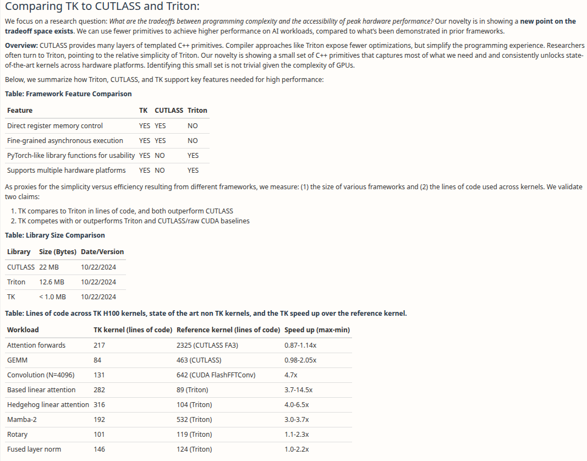

# A Review of ThunderKittens for General ML Audience
Proudly made with 🧠.

## What is TK?
TK is a CUDA lib that makes it easy to write speedy kernels.
## Purpose of this post
I am an ML researcher with no GPU programming experience prior to writing this blog. I’m going to review this work for its practical significance.
## Why you should care
ThunderKittens is one of my favorite works from Hazy Research (ICLR spotlight). Hazy Research is a high performance research lab led by Chris Ré, whose research is very relevant to the AI industry. Their research is likely directly integrated into the production systems at various AI companies and trading firms.

This is also one of the major recent advances in MLsys. If you are interested in ML, you should care about MLsys. Personally I think more of the recent breakthroughs in the ML space are on the systems side rather than better model architectures, training techniques, or data. Currently [*scaling laws*](https://blogs.nvidia.com/blog/ai-scaling-laws/) seem to still hold, so improving the efficiency of ML systems is a straightforward direction to improve AI capabilities and reduce cost. For trading specifically, I believe these works can be immensely helpful on enabling deep learning in high frequency trading systems, where latency is crucial.

*“But infra is boring!”* I used to think infra is boring until watching the [Horace He talk](https://www.janestreet.com/tech-talks/building-machine-learning-systems-for-a-trillion-trillion-floating-point-operations/).
## The current landscape of MLsys
- Pytorch: highest level deep learning framework. Includes a colossal toolbox of MLsys optimizations under the hood.
torch.compile: *machine learning compiler*, runs various “post processing” optimizations on the built torch compute graph. PyTorch’s principle is eager computation (code lines immediately triggers computation), but `torch.compile` enables many optimizations only possible on compute graph frameworks (like tensorflow v1, code declares compute graph and then everything runs at once).
- Triton: DSL for building cuda kernels. Uses python syntax. Very easy to learn and use for ML researchers but doesn’t yield the absolute maximum performance.
- CUDA: the low level framework embedded in C++ that everything above is built on top of. It’s documentation is colossal and somewhat scattered. As a ML researcher, this is what you would use to maximize performance with ad-hoc optimizations. There are helper libraries like cutlass (linear algebra lib) that make writing cuda easier. The current industry standard attention implementation, [FlashAttention](https://github.com/Dao-AILab/flash-attention) (1/2/3) is written in cuda. Flash attention is super fast, state of the art fast. However, it is considered an engineering marvel ([1200 lines of dense CUDA](https://github.com/Dao-AILab/flash-attention/blob/main/csrc/flash_attn/src/flash_fwd_kernel.h)) for a very specific purpose. TK is also a CUDA library like cutlass. It can be used to write kernels like FlashAttention.
## Why you should use TK
TK aims to put common optimizations into a CUDA library to make writing near-optimal CUDA a lot easier. It has a PyTorch-like API, so ML folks without experience in CUDA can pick it up fast. Triton has a similar goal, but the TK authors claim that optimal performance isn’t possible with Triton.

Moving from Triton to TK provides big performance gains. TK is significantly simpler to program than CUTLASS. See their OpenReview  response below.
    

    
This is great for researchers who need extra performance but have no CUDA expertise. It performs similarly as the current SOTA FA3.
## Technical details
The original TK paper is the best resource to fully understand the technical details. However, here is my 90% confident guess of how TK works on a high level.
- It does tiling and picks best memory layouts to utilize tensor cores, the fastest parts on an GPU.
- It gives program templates (C++ term for generics) for async computations. Devs just need to write a few boilerplate functions to coordinate async execution of computations.
- It handles scheduling. It tries to reuse [L2 cache](https://cvw.cac.cornell.edu/gpu-architecture/gpu-memory/memory_types#:~:text=L2%20Cache%20%2D%20is%20a%20further,shared%20by%20all%20the%20SMs.) and reduce pipeline idle time.
## Me trying TK.
My background: knows C++, zero prior knowledge on CUDA programming. I’m going to try to get TK up and running to see how easy it is to run and hack without domain knowledge.

_Note: this is not an instruction._

### Setup env
1. Cloned [repo](https://github.com/HazyResearch/ThunderKittens).
2. Installed nvidia drivers, cuda and latest gcc. Also installed pybind11 cpp lib.
3. Set up `CUDA_HOME` and made python venv. Install torch.
4. Ran into errors. Oh I needed to install pybind11 on python too.
5. Seemed like the official demo code has typos. I changed `in.batch` → `in.batch()`, etc to resolve this.
6. Kernel didn’t run at all. Oh cuda build target is by default H100. I’m too poor to afford that. Changed target to A100.

Running a demo copy kernel:

```cpp
#include "kittens.cuh"
#include "pyutils/pyutils.cuh"
using namespace kittens;

using my_layout = gl<float, -1, -1, -1, 64, st_fl<64,64>>;
struct globals {
    my_layout in, out;
    dim3 grid()  { return dim3(in.batch(), in.depth(), in.rows()); }
    dim3 block() { return dim3(in.cols()); }
};
__global__ void copy_kernel(const __grid_constant__ globals g) {
    g.out[{blockIdx.x, blockIdx.y, blockIdx.z, threadIdx.x}] = g.in[{blockIdx.x, blockIdx.y, blockIdx.z, threadIdx.x}];
}

PYBIND11_MODULE(example_bind, m) {
    py::bind_kernel<copy_kernel>(m, "copy_kernel", &globals::in, &globals::out);
```

Runnins the binding from python:

```python
import example_bind
import torch

input = torch.ones(16, 1024, 32, 64, device='cuda')
output = torch.ones_like(input)
example_bind.copy_kernel(input, output)
print(output.mean(), '\n')
```

Mean=1. Works!

Let’s do something more useful, like addition.

```cpp
#include "kittens.cuh"
#include "pyutils/pyutils.cuh"
using namespace kittens;

using my_layout = gl<float, -1, -1, -1, 64, st_fl<64,64>>; // An example layout that also instantiates a TMA descriptor on Hopper.
struct globals {
    my_layout a, b, out;
    dim3 grid()  { return dim3(a.batch(), a.depth(), a.rows()); }
    dim3 block() { return dim3(a.cols()); }
};
__global__ void add_kernel(const __grid_constant__ globals g) {
    g.out[{blockIdx.x, blockIdx.y, blockIdx.z, threadIdx.x}] = g.a[{blockIdx.x, blockIdx.y, blockIdx.z, threadIdx.x}] + g.b[{blockIdx.x, blockIdx.y, blockIdx.z, threadIdx.x}];
}
void run_add_kernel(globals g) { // demo troubleshooting code
    printf("I am calling the kernel from the host (cpu).\n");
    add_kernel<<<g.grid(), g.block()>>>(g);
    cudaError_t err = cudaGetLastError();
    if (err != cudaSuccess) {
        fprintf(stderr, "CUDA Error: %s\n", cudaGetErrorString(err));
    }
    cudaDeviceSynchronize();
}

PYBIND11_MODULE(example_bind, m) {
    py::bind_kernel<add_kernel>(m, "add_kernel", &globals::a, &globals::b, &globals::out);
    py::bind_function<run_add_kernel>(m, "wrapped_add_kernel", &globals::a, &globals::b, &globals::out); // calling kernel frox host (cpu)
}
```

Lets add one to random normal tensors.

```python
a = torch.ones(4, 8, 32, 64, device='cuda')
b = torch.randn(4, 8, 32, 64, device='cuda')
output = torch.zeros_like(a)
example_bind.add_kernel(a, b, output)
print(output.flatten()[:5])

output1 = torch.zeros_like(a)
example_bind.wrapped_add_kernel(a, b, output1)
print(output1.flatten()[:5])
```

The output:

```bash
tensor([2.3391, 1.0042, 1.5015, 0.4610, 1.2274], device='cuda:0')

I am calling the kernel from the host (cpu).
tensor([2.3391, 1.0042, 1.5015, 0.4610, 1.2274], device='cuda:0')
```

_Question: is randomness by default reproducible?_

This is amazing. Entire process since cloning the repo took <1hr, despite me running into a few issues.

However those demos are not utilizing the full power of TK. [Their official attention kernel implementation](https://github.com/HazyResearch/ThunderKittens/blob/main/kernels/attn/demo/4090.cu) uses TK specific functionalities like `kittens::group`, shared memory, etc. However, the actual computation logic is quite concise and familiar, almost like a PyTorch dialect:
```cpp
    ...
    for(int subtile = 0; subtile < LOAD_BLOCKS && (kv_idx*LOAD_BLOCKS + subtile)*ROWS<D> < g.Kg.depth(); subtile++) {
        load(k_reg, k_smem[subtile][tic]); // load k from shared into registers
        att_block = 0.f; // zero 16x16 attention tile
        mma<transpose::N, transpose::T>(att_block, q_reg, k_reg, att_block); // Q@K.T
        int first_index = (kv_idx*LOAD_BLOCKS + subtile)*ROWS<D>; // one past the last KV index of this tile
        int start_fill = g.Kg.depth()-first_index < ROWS<D> ? g.Kg.depth()-first_index : ROWS<D>;
        right_fill(att_block, att_block, start_fill, base_types::constants<float>::neg_infty());
        max_vec_last = max_vec;
        max_vec = max<axis::COL>(att_block, max_vec); 
        att_block = exp2(att_block - max_vec); 
        max_vec_last = exp2(max_vec_last - max_vec); 
        norm_vec *= max_vec_last; 
        norm_vec = sum<axis::COL>(att_block, norm_vec); 
        att_block_mma = att_block; // copy to bf16 tile
        load(v_reg, v_smem[subtile][tic]); 
        o_reg *= max_vec_last; 
        mma<transpose::N, transpose::N>(o_reg, att_block_mma, v_reg, o_reg);
    }
}
o_reg /= norm_vec;
```
    

## Additional Comments
In conclusion, TK is easy and can be picked up very fast. I didn’t test it myself but I believe writing custom kernels in TK can improve code performance. In HFT every μs matters! I noticed a few pain points absent on the TK propaganda, though:

1. The lib evolves extremely fast. Conflicting standards exist in the repo. For example, the relatively simple way of running kernels in python (with pybind) is only introduced in Nov 2024. The way to do python bindings was a lot more complicated before. This implies that TK may change their api frequently onwards. Things tend to get better, but porting code to the new version every few months is not fun.

2. Documentation is very lacking. Centralized documentation is close to none. I learned my way mostly through reading example codes. However, some examples refers to a random commit snapshot and looks out of date.

If you are a trader, TK may help you speed up your trading system and gain an edge over others. If you are an ML researcher, writing custom kernels might help you run faster experiments. If you work in ML sys, you might want to read the full paper and learn their tricks.
